# Learn MongoDB Query Writing

## Select All Data

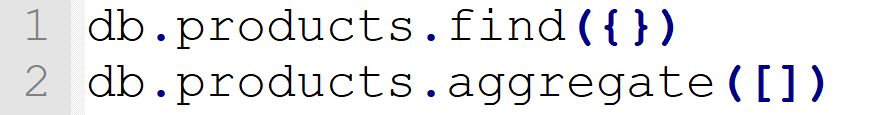

## Row Count

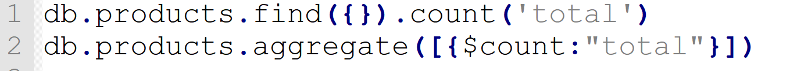

## Sorting

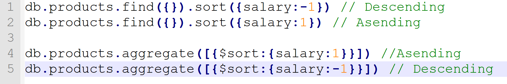

## Limiting

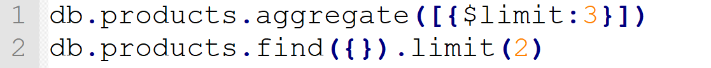

## Select First 5 And Last 5

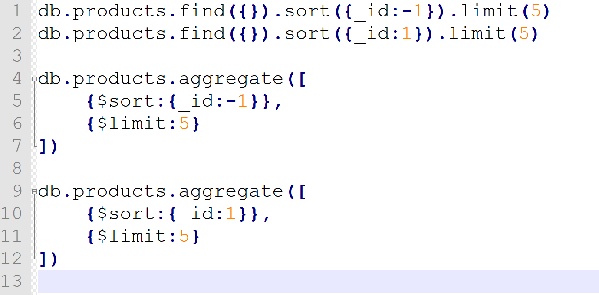

## Select by match

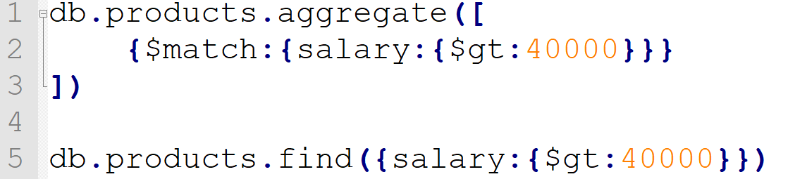

## Select by match AND /OR

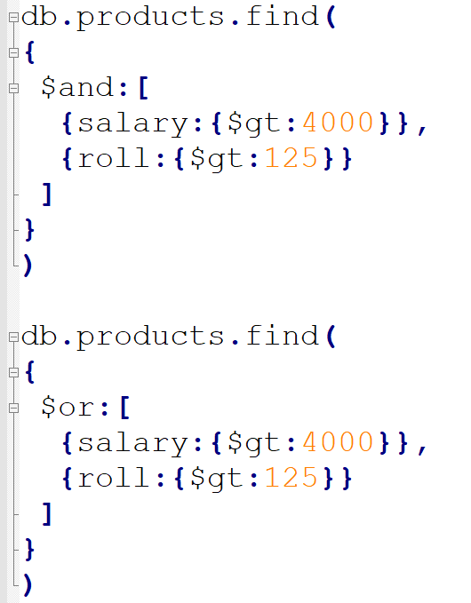
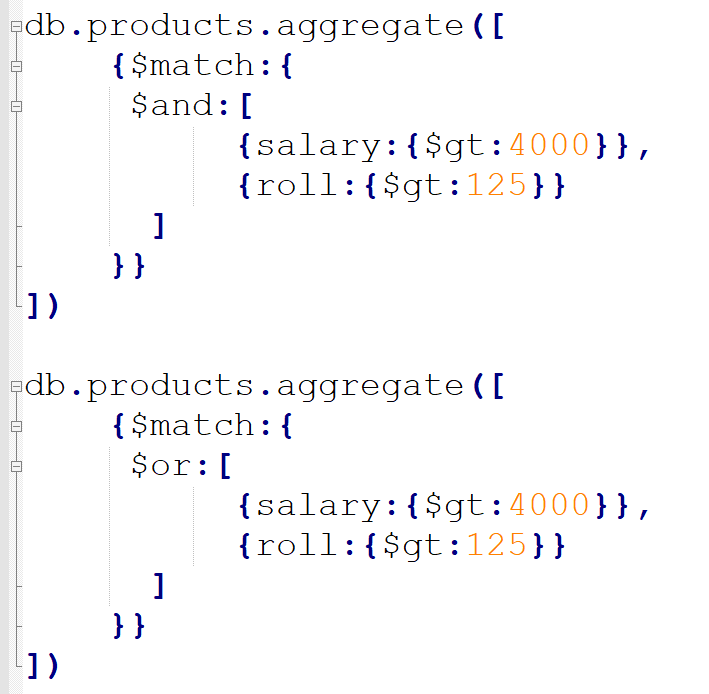

## Select by match Like

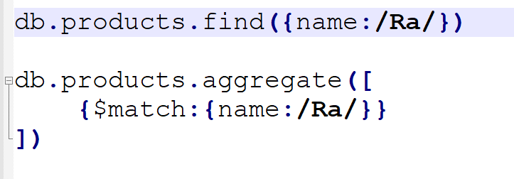

## Select by match in

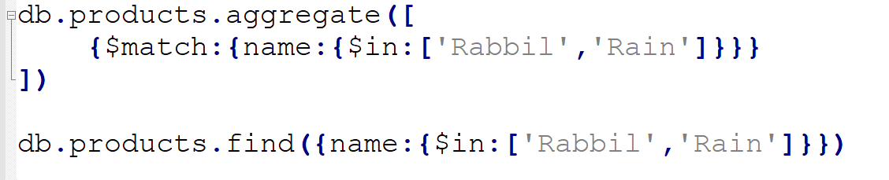

## Projection

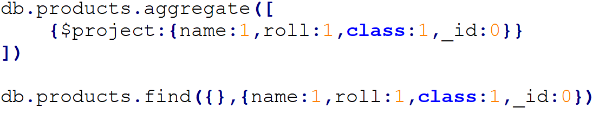

## Find SKIP With LIMIT

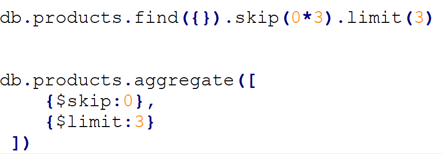

## Group By

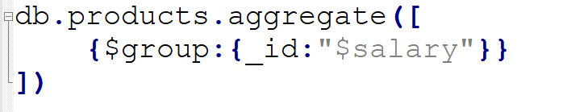

## Group By SUM

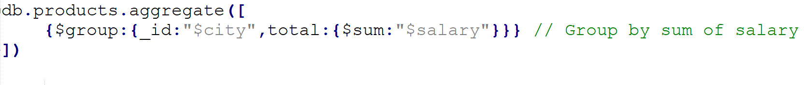

## Group By Avg

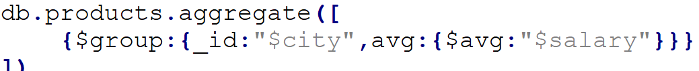

## Group By Max Min

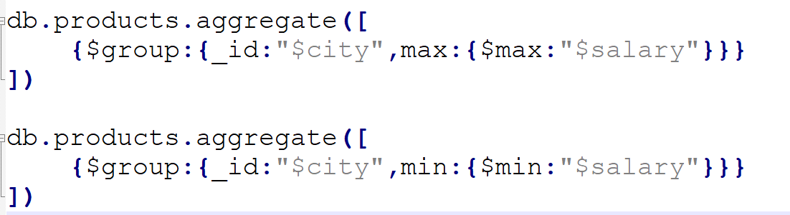

## Without Group By SUM /AVG /Max/ Min

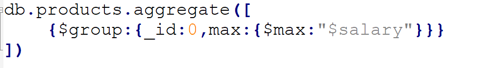
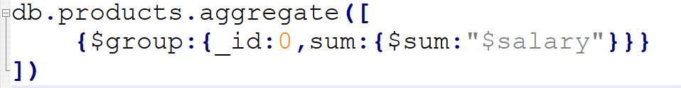
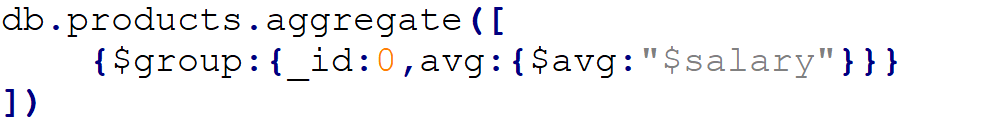

## Group By Multiple

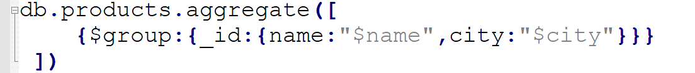
